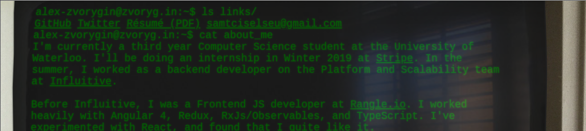

---
# Feel free to add content and custom Front Matter to this file.
# To modify the layout, see https://jekyllrb.com/docs/themes/#overriding-theme-defaults

layout: page
---

# Λrt

Most of these don't work to some degree on mobile.

*   [**Track**](../track), using object-tracking and CSS transforms to embed (interactive!) DOM elements onto a video of real space. 

*   [**IBM**](../ibm), a PowerPC terminal rendered in-browser. I tried to make it look as real as possible, the crt flickers, the letters glow and are skewed, and there's a reflection on the terminal. 

*   [**City**](../city), an animation (all CSS, no WebGL!) inspired by [the computer graphics from the landing scene in Escape From New York](https://vimeo.com/22393980) (which was done entirely without CG!). 

*   [**IRC in AR in a mobile browser**](https://youtu.be/E435CGmnS2k), using [ar.js](https://github.com/jeromeetienne/AR.js/blob/master/README.md) I embedded #csc on freenode into AR  

*   [**Recycle**](../recycle), a small joke website riffing on my friend's insistence that everyone recycle. 
